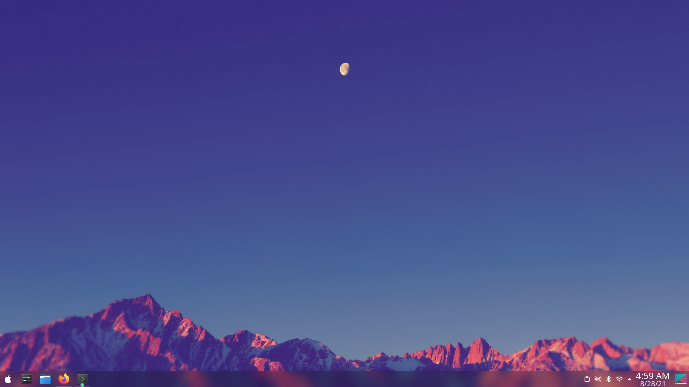
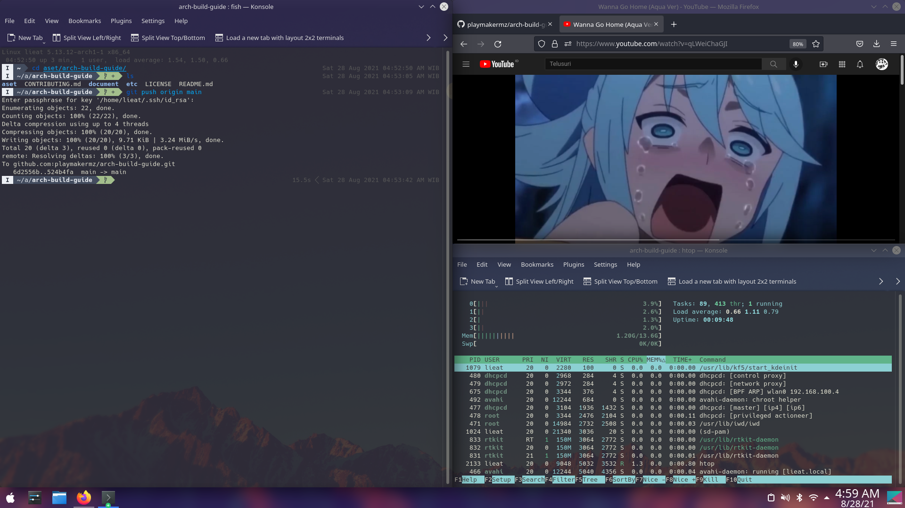
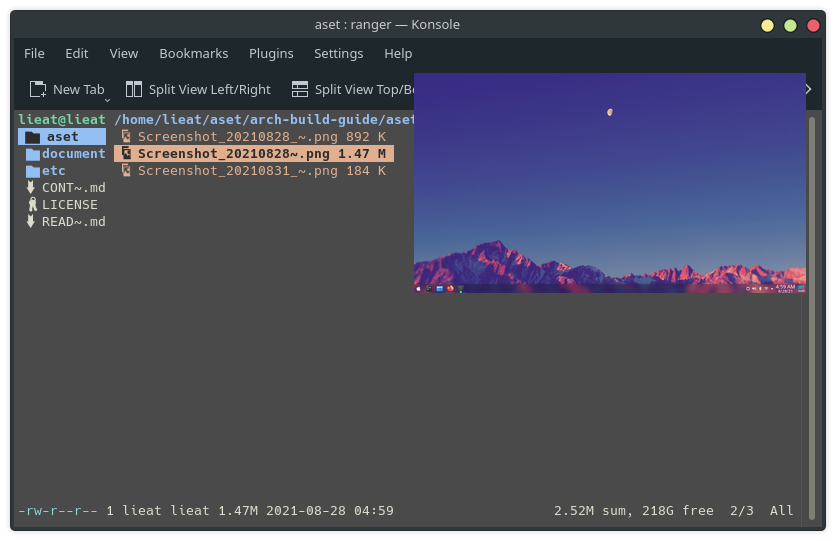

# Build Desktop With Arch linux 

Build Desktop Operating system using arch linux from zero to complete 
will take a lot of time for new user who don't have any experience in 
Building their dekstop from source.

The goal of this project is to build arch linux from zero to daily usage computer

several steps for build desktop arch:

- [Install arch](document/Install-archlinux.md)
- [Configure Network](document/configure-network-r8188eu.md)
- [Install desktop Environtment](document/Install-Desktop-Manager.md)
- [Configure Desktop KDE](document/Customize-KDE-Desktop.md)
- [Recommended application](document/recommendation-application.md)
- [Install printer](document/CUPS-Printer.md)
- [fish shell](document/fish-shell.md)
- [vim or nvim](document/vim-or-nvim-customize.md)
- [next cloud and virtualbox](document/nextcloud-self-host.md)
- [ranger file manager](document/ranger-file-manager.md)
- [Ventoy](document/Ventoy.md)

# Contributing

if you ecounter problem feel free to open issue, or if you want to add 
something feel free to pull request.

#### Refrensi

