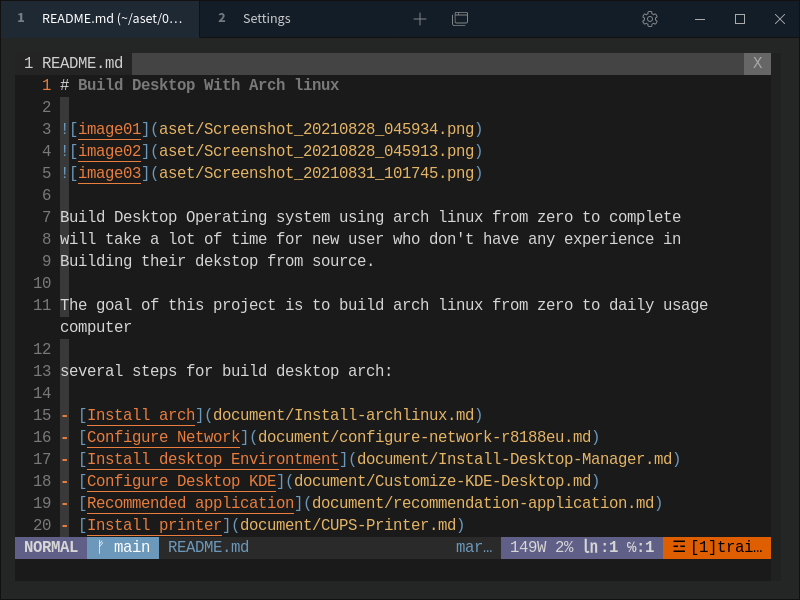

# Amix-vimrc


[Amix-vimrc](https://github.com/amix/vimrc)

```
git clone --depth=1 https://github.com/amix/vimrc.git ~/.vim_runtime
sh ~/.vim_runtime/install_awesome_vimrc.sh
```

install vim plug

```
curl -fLo ~/.vim/autoload/plug.vim --create-dirs \
    https://raw.githubusercontent.com/junegunn/vim-plug/master/plug.vim
```

## Example for vimrc
- `vmap <C-c> "+y`
"For copy paste, using vim-gtk3
- `<c-e>`
For using emmet 
- `<C-x>` and `<C-n>` to start select code completion 
- `<C-n>` to find matches file 

## Vim code completion
must have node js installed and vim plug 
1. Open vimrc, and add `Plug 'neoclide/coc.nvim', {'branch': 'release'}`
2. `PlugInstall`
3. open vim and type in vim console 
4. `:CocInstall coc-tsserver coc-json coc-html coc-css coc-pyright`


## My vimrc (~/.vim_runtime/my_configs.vim)
use this path(~/.vim_runtime/my_configs.vim) not .vimrc
```
call plug#begin('~/.vim/plugged')

Plug 'preservim/nerdtree'
Plug 'vim-airline/vim-airline'
Plug 'vim-airline/vim-airline-themes'
Plug 'jmcantrell/vim-virtualenv'
Plug 'danilo-augusto/vim-afterglow'
Plug 'whatyouhide/vim-gotham'
Plug 'mattn/emmet-vim'
Plug 'sheerun/vimrc'
Plug 'ap/vim-css-color'
Plug 'othree/html5.vim'
Plug 'NLKNguyen/papercolor-theme'
Plug 'joshdick/onedark.vim'
Plug 'neoclide/coc.nvim', {'branch': 'release'}


call plug#end()

colorscheme afterglow

" ================ Mapping ===========

noremap! <Leader><tab> <esc>gg=G<C-o><C-o>zz 
" auto indent file 
vmap <C-c> "+y
" For copy paste, using vim-gtk3
nmap <C-q> :q! 
" Exit file 
nmap <C-s> =G
" Indentation file, move cursor to the top of file and press C-s 


"
"============== Settings ==============
set background=dark

" background dark 
filetype indent on
set smartindent
autocmd BufRead,BufWritePre *.sh normal gg=G" 

" auto indent 
" Type (gg=G)
" to start indent the whole file 
" refrence https://unix.stackexchange.com/questions/19945/auto-indent-format-code-for-vim/19963

filetype on 
" Highlight cursor line underneath the cursor horizontally.
set cursorline

" Highlight cursor line underneath the cursor vertically.
set cursorcolumn

" vim emmet key 
let g:user_emmet_leader_key='<c-e>'

" ============= Autocompletion
filetype plugin on 
set omnifunc=syntaxcomplete#Complete

" refrence https://medium.com/vim-drops/css-autocompletion-on-vim-no-plugins-needed-e8df9ce079c7

" Press <C-x> and <C-o> to start autocompletion
" press <C-n> check the matches file 


```


## For more information about vim mapping
- https://www.techrepublic.com/blog/linux-and-open-source/create-custom-keybindings-in-vim/


## Refrence 
- https://github.com/neoclide/coc.nvim/wiki/Install-coc.nvim

