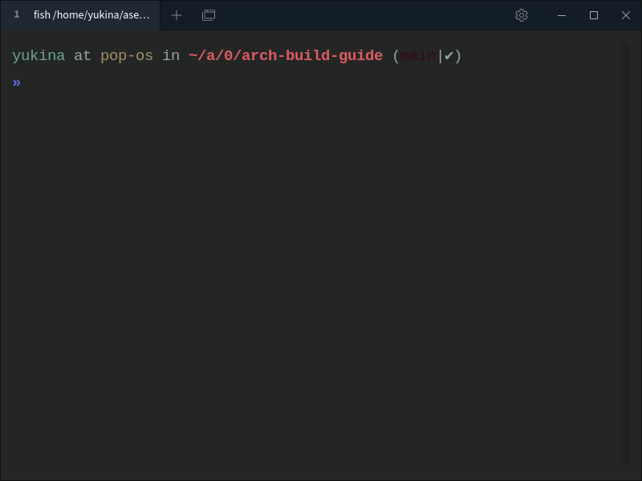

## Tabby installation


If you using ubuntu based, then install .deb package 

## My config
```
version: 3
profiles: []
hotkeys:
  toggle-window:
    - Ctrl-Space
  copy-current-path: []
  scroll-to-bottom: []
  ctrl-c:
    - Ctrl-C
  copy:
    - Ctrl-Shift-C
  paste:
    - Ctrl-Shift-V
    - Shift-Insert
  select-all:
    - Ctrl-Shift-A
  clear: []
  zoom-in:
    - Ctrl-=
    - Ctrl-Shift-=
  zoom-out:
    - Ctrl--
    - Ctrl-Shift--
  reset-zoom:
    - Ctrl-0
  home:
    - Home
  end:
    - End
  previous-word:
    - Ctrl-Left
  next-word:
    - Ctrl-Right
  delete-previous-word:
    - Ctrl-Backspace
  delete-next-word:
    - Ctrl-Delete
  search:
    - Ctrl-Shift-F
  pane-focus-all:
    - Ctrl-Shift-I
  restart-telnet-session: []
  restart-ssh-session: []
  launch-winscp: []
  settings:
    - Ctrl-,
  serial:
    - Alt-K
  restart-serial-session: []
  new-window:
    - Ctrl-Shift-N
  new-tab:
    - Ctrl-Shift-T
  profile: {}
  profile-selectors: {}
  toggle-fullscreen:
    - F11
  close-tab:
    - Ctrl-Shift-W
  reopen-tab:
    - Ctrl-Shift-T
  toggle-last-tab: []
  rename-tab:
    - Ctrl-Shift-R
  next-tab:
    - Ctrl-Shift-Right
    - Ctrl-Tab
  previous-tab:
    - Ctrl-Shift-Left
    - Ctrl-Shift-Tab
  move-tab-left:
    - Ctrl-Shift-PageUp
  move-tab-right:
    - Ctrl-Shift-PageDown
  rearrange-panes:
    - Ctrl-Shift
  duplicate-tab: []
  tab-1:
    - Alt-1
  tab-2:
    - Alt-2
  tab-3:
    - Alt-3
  tab-4:
    - Alt-4
  tab-5:
    - Alt-5
  tab-6:
    - Alt-6
  tab-7:
    - Alt-7
  tab-8:
    - Alt-8
  tab-9:
    - Alt-9
  tab-10:
    - Alt-0
  tab-11: []
  tab-12: []
  tab-13: []
  tab-14: []
  tab-15: []
  tab-16: []
  tab-17: []
  tab-18: []
  tab-19: []
  tab-20: []
  split-right:
    - Ctrl-Shift-E
  split-bottom:
    - Ctrl-Shift-D
  split-left: []
  split-top: []
  pane-nav-right:
    - Ctrl-Alt-Right
  pane-nav-down:
    - Ctrl-Alt-Down
  pane-nav-up:
    - Ctrl-Alt-Up
  pane-nav-left:
    - Ctrl-Alt-Left
  pane-nav-previous:
    - Ctrl-Alt-[
  pane-nav-next:
    - Ctrl-Alt-]
  pane-maximize:
    - Ctrl-Alt-Enter
  close-pane: []
  switch-profile:
    - Ctrl-Alt-T
  profile-selector:
    - Ctrl-Shift-T
terminal:
  searchOptions: {}
  colorScheme:
    name: SoftServer
    foreground: '#99a3a2'
    background: '#242626'
    cursor: '#d2e0de'
    colors:
      - '#000000'
      - '#a2686a'
      - '#38061f'
      - '#a3906a'
      - '#6b8fa3'
      - '#6a71a3'
      - '#6ba58f'
      - '#99a3a2'
      - '#666c6c'
      - '#dd5c60'
      - '#bfdf55'
      - '#deb360'
      - '#62b1df'
      - '#606edf'
      - '#64e39c'
      - '#d2e0de'
  profile: local:usrbinfish
  customColorSchemes:
    - name: DimmedMonokai
      foreground: '#b9bcba'
      background: '#1f1f1f'
      cursor: '#f83e19'
      colors:
        - '#3a3d43'
        - '#be3f48'
        - '#C3EBEB'
        - '#c5a635'
        - '#4f76a1'
        - '#855c8d'
        - '#578fa4'
        - '#b9bcba'
        - '#888987'
        - '#fb001f'
        - '#0f722f'
        - '#c47033'
        - '#186de3'
        - '#fb0067'
        - '#2e706d'
        - '#fdffb9'
    - name: Atom
      foreground: '#c5c8c6'
      background: '#161719'
      cursor: '#d0d0d0'
      colors:
        - '#000000'
        - '#fd5ff1'
        - '#540024'
        - '#ffd7b1'
        - '#85befd'
        - '#b9b6fc'
        - '#85befd'
        - '#e0e0e0'
        - '#000000'
        - '#fd5ff1'
        - '#94fa36'
        - '#f5ffa8'
        - '#96cbfe'
        - '#b9b6fc'
        - '#85befd'
        - '#e0e0e0'
    - name: Afterglow
      foreground: '#d0d0d0'
      background: '#212121'
      cursor: '#d0d0d0'
      colors:
        - '#151515'
        - '#ac4142'
        - '#800080'
        - '#e5b567'
        - '#6c99bb'
        - '#9f4e85'
        - '#7dd6cf'
        - '#d0d0d0'
        - '#505050'
        - '#ac4142'
        - '#7e8e50'
        - '#e5b567'
        - '#6c99bb'
        - '#9f4e85'
        - '#7dd6cf'
        - '#f5f5f5'
  linePadding: 5
  autoOpen: true
  background: colorScheme
  ligatures: true
  fontSize: 19
ssh: {}
configSync:
  parts: {}
clickableLinks: {}
appearance:
  opacity: 0.95
hacks: {}
enableAnalytics: false
enableWelcomeTab: false
pluginBlacklist: []
profileDefaults: {}
tronFlags:
  - - force_discrete_gpu
    - '0'
electronFlags:
  - - force_discrete_gpu
    - '0'
recoverTabs: false

```
## setting font size
open apperance

## Refrence 
- https://tabby.sh/ 
- https://github.com/ohmyzsh/ohmyzsh/wiki/Themes 
- https://github.com/ohmyzsh/ohmyzsh/wiki/Themes 
